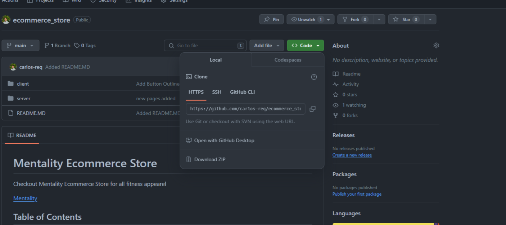

# Mentality Ecommerce Store

Checkout Mentality Ecommerce Store for all fitness appearel

[Mentality](https://cc-cleaning.vercel.app/)

## Table of Contents

- [Screenshots](#screenshots)
- [Setup](#setup)
- [Technologies](#technologies)

### Screenshots

Mentality Landing Page.🙂

    

### Setup

Git, Node.js, and NPM are required to run this project. Install Git by [following this](https://git-scm.com/book/en/v2/Getting-Started-Installing-Git). If you don't have Node and NPM installed please follow [these instructions](https://docs.npmjs.com/downloading-and-installing-node-js-and-npm).

1. Click the green code button:

2. From there, click the button to the right of the URL under HTTPS. This will copy the URL of the repository.

3. Then open your terminal or command line. If you haven't used the command line before [learn how to here](https://www.theodinproject.com/lessons/foundations-command-line-basics).

4. If you've got a folder where you keep projects, change directories into that folder. After that type this command:

`git clone https://github.com/carlos-req/ecommerce_store.git`

This clones the repository to your local machine. It has a root directory called `mentality` to store all the files.

5. Change directories into that folder:

`cd mentality`

After that you can open the project in your text editor of choice. I use Visual Studio Code and launch it from the command line. [Learn how here](https://code.visualstudio.com/docs/setup/mac).

6. Once you have the project open, you need to install the dependencies. Run this in your command line from the root (adopt-a-pet folder) of the project:

`npm install`

7. After that finishes, run this to start the project:

`npm run dev`

### Technologies

- [Vite](https://vitejs.dev/guide/)
- [React](https://react.dev/learn)
- [TailwindCSS](https://tailwindcss.com/docs/installation)
- [NodeJS](https://nodejs.org/en/learn/getting-started/introduction-to-nodejs)
- [Express.JS](https://expressjs.com/en/starter/installing.html)
- [MongoDB](https://www.mongodb.com/docs/)
- JavaScript

# 🏋️ Mentality - Ecommerce Store

Mentality is a Ecommerce store with Vite, React, Redux, Node, Express, MongoDB and other technologies. This Ecommerce store is made to be a full stack application handling both client and server functionality.

## 🚀 Features

- 🗝 Sign in & Register using JWT
- 👤 View your own profile, email, name, orders, etc.
- 🗨 Selection of clothing
- 📬 Admins can edit:
  - 📁 Product Name
  - 🖼 Product Images
  - 📝 Product Description
  - 👥 User roles
- 🔎 Search for products
- 📥 Drag and drop to upload files and images
- 🌓 Toggle between light mode and dark mode

## 🛠️ Main Technologies

- `React`
- `Redux`
- `Node`
- `Express`
- `MongoBD`
- `TailwindCSS`
- `Vite`

## 📝 Process

I started with

## 🤔 How Can It Be Improved?

It would be amazing if users were able to send GIFs and stickers, just like on WhatsApp. Also, being able to send voice messages and videos to each other would greatly improve the project. Adding testing would be beneficial as well, something I definitely plan to do next time.

## 🐛 Current Bug

So far, I'm not really sure if there are any bugs. However, there might be some issues on the mobile version. I tested it out on my phone (iPhone 14 Pro Max), and so far it looks good there, but on smaller devices or Android phones, it might look a bit odd. I'm not sure from that side, but there might be some bugs to iron out.

<h3> 📸 - Demo Images </h3>

#

#

#

#

#

#

#

#

#

